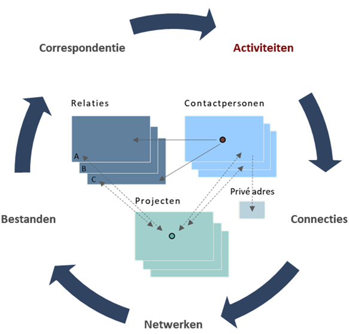

# Inleiding Snel start CRM Connect

Deze ‘Snel start’ biedt basis handvatten om het onderdeel ‘Relatiebeheer’ op te starten.
> [!DEBUG] Kennisoverdracht
- wij adviseren aanvullende ondersteuning om het hulpmiddel optimaal procesmatig  in te zetten en te benutten.

CRM Connect biedt meer standaard functionaliteiten, zoals hieronder schematisch weergegeven.

Voor installatiedetails en/of overige technische specificaties, zijn op aanvraag handleidingen en procedure beschikbaar.

 > [!WARNING] Schermverschillen
- Binnen de handleiding worden schermvoorbeelden getoond, deze kunnen afwijken van je eigen	schermen.

Naast systeem versie verschil, kan dit komen door een andere persoonlijke kleurstelling en - kolommen volgorde, per onderdeel (relatie, contact, project en activiteiten).

> [!NOTE] NB, altijd invoeren
- basis NAW gegevens

> [!IDEA] Tip, sneltoetsen gebruik
- investeer 5 minuten en je bespaart veel tijd

1. [Drie hoofdonderdelen](#drie-hoofdonderdelen)
1. [Online korte impressie](https://youtu.be/hX1KOqlBr9s)

**Kanttekening:**
> Hoewel bij het samenstellen van de programmatuur en deze handleiding de grootst mogelijke zorgvuldigheid is betracht, kan noch de auteur, noch de uitgever enige aansprakelijkheid aanvaarden voor enige schade die zou kunnen voortvloeien uit enige fout die in het programma en/of in deze uitgave zou kunnen voorkomen. CRM Connectivity, als producent van het programma en de handleiding, houdt zich het recht voor om zonder enige kennisgeving wijzigingen in de programmatuur en/of handleiding door te voeren. 
Handleiding CRM Connect Relatiebeheer - CC Relatiebeheer

Auteurs: Patrick Dekker en Hans Koenhen Versie: 2.0.1

**De centrale kaartenbak is de basis voor succes**
Informatie wordt op de meest diverse plekken binnen organisaties vastgelegd, van Rolodex (kaartenbak) tot computerbestand, van hangmap tot menselijk brein en van LinkedIn tot in de Cloud.

Door opbouw van één centrale database en segmentatie, ook wel het labelen c.q. markeren van relaties en/of contactpersonen, ontstaat een beter inzicht rond relaties. De relatie database wordt de spil binnen uw organisatie. Uw manier van werken wordt hiermee relationeel en informatie is centraal voor iedereen beschikbaar door opbouw van een digitaal dossier. We nemen u stap voor stap mee in het gebruik van het relatiebeheer systeem. Uw dagelijkse werkzaamheden worden hiermee ondersteund. Dit zal resulteren in een beter inzicht rond relaties en tijdbesparing met inzet van het hulpmiddel software.

# Drie hoofdonderdelen
Binnen CRM Connect onderscheiden wij de volgende niveaus:

1. Relaties (bedrijven, relaties, e.a.) ,
2. Contactpersonen en
3. Projecten.

[Activiteiten] is een prominent proces onderdeel binnen het systeem en ondersteunt de drie hoofdonderdelen.
Binnen de ‘snel start’ behandelen wij alléén het werken met Relaties en Contactpersonen. Project gebruik wordt kort belicht. Ook gaan wij ervan uit dat MS Office is geïnstalleerd. Dit inzake de diverse standaard koppelingen met MS Word, Outlook en Excel. Vraag de interne beheerder naar de werking.

 
CRM Connect is een MDI applicatie (Multiple Document Interface)

Voordeel:	je kan meerdere schermen naast elkaar openen
Nadeel: 	In het begin kan je het overzicht verliezen, zet schermen goed en vervolgens vast
	- linksboven via icoon      via x Sluiten of [Ctrl + F4]

De [Esc] toets kan in het begin uitkomst bieden, elk scherm kun je zo afzonderlijk sluiten.
Alle schermen zijn ook in één keer te sluiten met [Alt- O-U]. Neem de tijd om je weg te vinden!
Via Opties > Gebruiker optie.. kan je altijd terug naar de basis instellingen: Reset vensterinstellingen

## Zoeken op Relatie- en contactniveau

Na het inloggen start automatisch het zoekscherm. Dit is instelbaar onder Opties > Gebruiker opties… Mocht dit niet het geval zijn kan je kiezen voor de optie Relaties in de menubalk.

Gericht zoeken op relatie- of contactpersoon niveau en direct aan de slag met het zoekresultaat.

Binnen dit zoekscherm kan je zoeken op *:

- Organisatie, Voornaam, Achternaam, Telefoon, Mobiel, Plaats, Postcode, Land, Deb.nr., KvK nr. dit kan ook op een deel van een naam of met % ondersteuning

Standaard wordt de relatie geopend, door het aanvinken van	wordt de   Contactpersoon kaart geopend.

Met het gevonden resultaat kan je direct proactief gebruik maken van de rechtermuis functie.
Maak binnen een handomdraai een export naar Excel (van de scherm selectie) of ga direct contact details bekijken via Google of LinkedIn. Zonder eerst de relatiekaart te openen.

Enkele efficiënte zoek voorbeelden worden behandeld onder het onderdeel “Schermfunctionaliteit binnen het relatie detailscherm”. Deze zijn ook direct te starten vanuit een zoekresultaat, zonder een relatie- of contactpersoon scherm te openen.

Relatiescherm inzicht

Na het openen van de relatie vanuit het zoekscherm kom je in het Relatie detail scherm van de betreffende organisatie/ bedrijf/ instelling. Een relatiescherm met overzicht rond algemene NAW+ en contactpersoon gegevens. Daarnaast zijn er diverse opties om gedetailleerd inzicht rond het relatiedossier op te bouwen. Ook zijn er direct acties en processen te starten, we nemen er enkele met u door.

Schermfunctionaliteit binnen het relatie detailscherm
Als een relatie eenmaal opgeslagen is, zijn er een aantal functies en hyperlinks te zien.
Deze functionaliteit komt in alle onderdelen van CC Relatiebeheer terug, dus ook bij Projecten.
Hyperlinks
Hyperlinks zijn te herkennen aan de gekleurde en onderstreepte tekst. Als u met de muis over de link beweegt, verandert uw muispijltje in een handje. Door op deze tekst (hyperlink) te klikken, wordt automatisch de actie/toepassing opgestart.

Bij een emailadres zal dat MS Outlook zijn, om een nieuwe email aan te maken. Maar bijvoorbeeld bij het webadres van een organisatie, zal de browser opgestart worden.

Maar ook zijn er handige hulpmiddelen te vinden zoals "Tijd".  
Dit is handig bij relaties, die zich in het buitenland bevinden. Hiermee kan eenvoudig en snel de lokale tijd bekeken worden, zodat er bepaalt kan worden of iemand in die tijdzone bereikbaar is.

Relatie- contactpersoon dossier print

Met één druk op de knop direct een compleet relatie- of contactpersoon dossier met alle data

Gegevens tonen in een browservenster

*Voordelen:*
	- selecteerbaar, dus kopieerbaar (om elders te 'plakken')
	- eenvoudig afdrukken met de printers die binnen Windows gedefinieerd zijn.
	- gekoppeld met een stylesheet, dus aanpasbaar aan uw eigen huisstijl.
	- eenvoudig in het html formaat "Opslaan als"

**Externe koppelingen**

Inleiding
Externe koppelingen kunnen geactiveerd worden vanuit het gevonden resultaat. U kunt direct proactief gebruik maken van de rechtermuis functie. Vanuit het Extern zoeken overzicht start u direct andere programmatuur met de gegevens van de in beeld staande relatie of contactpersoon, deze worden doorgegeven aan de te starten applicatie. Vraag Applicatie-/Systeembeheerder om Externe koppelingen in te richten. Knippen plakken van tekst, het kopiëren van afbeeldingen middels slepen (drag and drop), e.t.c.. Voordeel geen scherm openen

Voorbeeld: Google via Externe koppeling, zoeken met aanwezige relatiegegevens

Beheer Externe koppelingen/zoeken
Deze kunnen zelf beheert worden via: Menu > Opties > Beheer Relatie elementen > en dan Externe koppelingen organisatie/contactpersoon.

Er kunnen gegevens uit het detailscherm van de relatie automatisch meegenomen worden met opstarten van de toepassing.
Bijvoorbeeld de naam van een relatie meegeven aan Google, zodat je meteen het zoekresultaat binnen Google ziet, nadat Google in het menu geselecteerd is.

Toevoegen van een relatie

Invoer van o.a. organisatie/bedrijfsnaam. Betreft het een Privéadres laat dit veld dan leeg. In het zoek overzicht ziet u dan Privé of maak er bijvoorbeeld Familie de Vries van en voeg later de gezinsleden toe.

Indien u een relatie wilt invoeren, neem de volgende stappen:
- Open het Relatie en Contactpersonen zoekscherm (Menu > Relaties > Overzicht)
- Kies voor de knop "Toevoegen Relatie"
- Vul de primaire gegevens in
- U kunt direct 1 contactpersonen toevoegen of koppelen (van een reeds al eerder ingevoerde contactpersoon) en kies voor "Opslaan".

Verwijderen van een relatie

Start met Wijzigen vanuit het Relatie detail scherm
Let op!: de stap Relatie verwijderen geeft na indrukken nog één waarschuwing!
Weet u zeker….. na [Ja] is uw keuze definitief!

Toevoegen contactpersoon
Alvorens u een naam intikt controleert u of de contactpersoon al in de database voorkomt, dit voorkomt dubbele invoer.

Als dit niet het geval is dan begint u met het invoeren contactgegevens (hoofdletters gaan vaak vanzelf). Wees compleet en secuur. LET OP! punten tussen en na initialen. Vergeet niet de Aanspreekvorm (De heer/Mevrouw) in te vullen i.v.m. aanhef in de brief, fax, etiket, etc.!

Er kunnen op meerdere manieren contactpersonen ingevoerd worden binnen het systeem.
- Via het Relatie detailscherm  
- Direct vanuit het scherm voor Relatieoverzicht

De eerste optie zal meestal gebruikt worden voor contactpersonen, waarvan u de relatie al ingevoerd heeft. De tweede optie wordt meestal gebruikt voor 'particulieren'.

Tevens kan een bestaande contactpersoon ook 'gekoppeld' worden aan een relatie. Dus als de contactpersoon al eens eerder is ingevoerd, kan deze bij een relatie 'bekend' gemaakt worden. Dit gebeurt o.a. als een persoon bijvoorbeeld van werkgever is veranderd of gewoonweg meerdere werkgevers heeft.
Toevoegen nieuwe contactpersoon via het Relatie detail …
Neem de volgende stappen:
1. Open het Relatie detailscherm … waar de contactpersoon bij hoort
2. Zorg ervoor dat het eerste tabblad "Contactpersonen" actief staat
3. Kies voor "Toevoegen" rechts op het tabblad "Contactpersonen"
4. Vul de gegevens in en kies voor "Opslaan"

In dit scherm is al te zien, dat er onderscheid wordt gemaakt tussen de gegevens van de contactpersoon zelf en de gegevens van de contactpersoon bij de relatie.
Als men hier dus voor wijzigen kiest, dan komt er een scherm waar u de gegevens tussen de contactpersoon en de relatie kan wijzigen. (denk aan functie, emailadres, doorkiesnummer etc) Dit zijn dus de gegevens van de contactpersoon, die alleen bij deze relatie gelden.  
De bediening kan ook geactiveerd worden middels de rechtermuisknop functie.
Toevoegen van een particulier
Er zullen ook contactpersonen zijn, die niet perse direct aan een relatie gekoppeld zijn. Vaak zijn dit netwerkrelaties, kennissen, vrienden en of familie. Toch kunnen er redenen zijn, om deze contactpersonen wel in het systeem te willen bijhouden. Bijvoorbeeld omdat u aan het einde van het jaar een kerstkaart zou willen sturen (per post of e-mail).

Neem de volgende stappen om een losse contactpersoon in te voeren
- Open het relatie zoekscherm (Menu -> Relatie -> Overzicht)
- Kies voor de knop "Toevoegen contactpersoon"
- Vul de primaire gegevens in en kies voor "Opslaan"

Nadat er voor "Opslaan" is gekozen, zullen de tabbladen bij "Overig" tevoorschijn komen.

 
Invoeren van contactpersoon Kenmerken
Doel hiervan is om heel gericht te kunnen selecteren.
-	Klik op de Tab Kenmerken
-	Kies Toevoegen
- Zoek in de tabel die verschijnt het(de) juiste kenmerk(en)

Bijvoorbeeld: persoon en relatie gebonden kenmerken zoals ‘Businessclub lid’ of een hobby als ‘Golf’ is handig om vast te leggen. Dit om later alle golfers te selecteren en uit te nodigen. Ook kan aangeven worden wie het contact is voor facturatie, inkoop, beslisser is, loyaal aan ons bedrijf is, e.t.c..

Na invoer kan eenvoudig met mouse-over de inhoud van de Tab worden weergegeven

 
Overzicht contactpersoon detail scherm

Na invoer van een contactpersoon heeft u direct toegang tot een overzichtelijk detail scherm. Mensen zijn uniek binnen de database toe te voegen. U als gebruiker bent vaak de zwakste schakel inzake dubbele gegevens binnen de database. Kijk eerst of de relatie in de database aanwezig is alvorens deze toe te voegen. Met koppelen voorkom je extra werk!.

Vanuit dit scherm kan je naast een Contactpersoon dossier print direct ook informatie zichtbaar maken of acties uitvoeren zoals:
- Activiteiten aanmaken,
- Brieven maken,
- Bestanden koppelen e.a..

Snel contact inzicht door:
- Connecties (netwerken),
- Kenmerken toevoegen voor selectie en
- via  Werkzaam bij, koppelen aan meerdere relaties en daarbij verschillende rollen toe te kennen.

Koppelen van een contactpersoon
Als de contactpersoon reeds in het systeem aanwezig is, kan deze contactpersoon eenvoudig gekoppeld wordt aan een relatie (bijvoorbeeld omdat deze persoon van relatie is veranderd), neem dan de volgende stappen.
1. Open het relatie detailscherm waar de contactpersoon aan gekoppeld dient te worden
2. Zorg ervoor dat het eerste tabblad "Contactpersonen" actief staat
3. Kies voor "Koppelen" op het tabblad "Contactpersonen"
4. Er verschijnt nu een zoekscherm waarmee u de betreffende contactpersoon kan opzoeken
5. Selecteer de contactpersoon en vul de gegevens in en kies voor "Opslaan"

Zoals hier op de afbeelding te zien is, is er bij functie en afdeling een 'uitklap-lijstje' te zien.

Het Functie (visitekaartje) veld is een 'zelf lerend lijstjes'.  Indien u al een functie eerder ingevoerd heeft, zal deze in dit lijstje te zien zijn. Op deze manier wordt geprobeerd te voorkomen, dat er dubbele functies of afdelingen ingevoerd worden met eigenlijk de exact dezelfde betekenis.
Het verwijderen van een contactpersoon (/bij een relatie)
Er kan op twee manieren aan het systeem aangegeven worden, dat een bepaalde contactpersoon niet meer bij de relatie werkt.
1. Door de contactpersoon gewoon bij de relatie te verwijderen
2. Door aan te geven, dat de contactpersoon niet meer bij de relatie werkt

Voor de eerste optie, kan je gewoon voor de knop "Verwijderen" kiezen op het tabblad van de contactpersonen bij een relatie.
Let hierbij wel op, dat alleen de koppeling wordt verwijderd tussen de contactpersoon en de relatie!
Indien u de contactpersoon helemaal uit het systeem wilt hebben, open dan het detailscherm van de contactpersoon. Kies voor "Wijzigen" en vervolgens voor "Verwijderen". Op deze manier zal de contactpersoon (+ alles wat daar aan gekoppeld is) echt werkelijk uit het systeem verwijderd worden.

Start met Wijzigen vanuit het Contactpersoon detail scherm
Let op!: de stap Contactpersoon verwijderen geeft na
indrukken nog één waarschuwing!

Weet u zeker….. Na [Ja] is uw keuze definitief!

     lees goed | voorkom ongemak

Contactpersoon is niet meer werkzaam bij de relatie

Mocht u te horen krijgen dat een contactpersoon niet meer werkzaam is, en nog niet duidelijk is waar hij/zij nu werkzaam is. Kan het nuttig zijn, om alleen aan te geven dat de betreffende contactpersoon niet meer werkzaam is bij de relatie.
Kies dan op het tabblad van de contactpersonen voor de knop "Wijzigen" en zet vervolgens het vinkje "Niet meer werkzaam" aan.

Vanaf dit moment blijft de contactpersoon gewoon in het systeem, maar zal de tekst 'doorgehaald' zijn. En op deze manier kan dus in één oogopslag gezien worden, dat de contactpersoon niet meer werkzaam is bij de betreffende relatie, maar kan nog steeds wel gezien worden wat deze persoon heeft gedaan bij de relatie.

Hierboven is duidelijk te zien aan de doorgehaalde tekst, dat de contactpersoon niet meer bij de relatie werkzaam is.

Specifiek relatieprofiel
Zowel bij de relatie als bij de contactpersoon zijn er een aantal velden beschikbaar waarbij u zelf het label kunt bepalen.
Deze optie wordt geboden omdat er altijd wel zaken zijn waarvan gewenst is om ze te registreren, maar vaak ook specifiek voor uw proces zijn. Daarom hebben we 10 velden beschikbaar gesteld, waar u als gebruiker zelf een naam aan kan toekennen. Deze velden kan je vinden op het Specifiek relatieprofiel tabblad. Op relatie- en ook op contactpersoon niveau.

Standaard zullen deze velden aangegeven worden met Vrijveld01 t/m Vrijveld10. En deze 'labels' kan je zelf definiëren via Menu > Opties > Beheer Relatie elementen -> en dan Vrije velden relatie of contactpersoon.
Specifiek relatieprofiel voorbeeld

In dit voorbeeld is (via het beheer) Vrijveld01 gewijzigd in "Status" en Vrijveld02 in "Segment …".

Tevens zijn op dit tabblad ook zaken als KVK nummer, Bank, IBAN, BTW (etc) te vinden.

Specifiek contactprofiel voorbeeld

Kenmerken
Kenmerken toevoegen maakt het mogelijk gerichte selecties te maken vanuit het Relatie en Contactpersonen Zoeken scherm, Tab [Selecties]. U kunt zelf de kenmerken aanmaken via Menu > Opties > Beheer Relatie elementen > en dan Relatie of Contactpersoon kenmerken.
zoveel mogelijk informatie toe. Zeker in de netwerk c.q. prospectfase is dit een ideaal hulpmiddel voor het toevoegen van extra informatie. Hierdoor ontstaat een beter relatie inzicht (optimale dossier opbouw). Doel is om met deze selecties acties te kunnen doorvoeren o.b.v. segment kenmerken. Voer

Invoeren van Relatiekenmerken:

Kenmerken kan je eenvoudig toekennen aan een relatie en/of contactpersoon met

Tip: 	Indien u meerdere kenmerken tegelijkertijd wilt invoeren bij een
 	relatie of contactpersoon, kunt de m.b.v. de [CTRL]-toets
meerdere kenmerken in één keer selecteren en vervolgens
voor "Opslaan" kiezen.

Na invoer kan met mouse-over (ga met de cursor over de Kenmerken Tab) een overzicht worden gegenereerd, zonder door te klikken (op de Tab).

Notities
Wanneer gebruik u Notities?  Hier worden de actieve / dynamische gegevens verwerkt, bijvoorbeeld de berichtgeving c.q. opvolging over afspraken (documentatie verzending), sales, bestellingen, e.t.c.

Het is belangrijk om proces ondersteunende notities bij de relatie te bewaren. CC Relatiebeheer biedt u deze mogelijkheid. Dit inclusief:
- notitiesoort,
- medewerker koppeling,
- aanpasbare datuminvoer en
- contactpersoon keuze

Om zelf de notitiesoorten te kunnen beheren, ga naar: Menu > Opties > Beheer Relatie elementen > en kies dan voor "Notitiesoorten".

Activiteiten inzicht

Overzicht van Actieve en Gearchiveerde activiteiten, direct vanuit het Menu > Activiteiten.

Ter info: 'Activiteiten' zijn dus zaken die vooraf gepland kunnen worden.(bijvoorbeeld een bel actie over een half jaar) Dit is dus een belangrijk verschil met 'gemaakte uren' bij een bijvoorbeeld een project. (wordt niet in dit document behandeld*) Die 'activiteiten' worden namelijk achteraf ingevoerd en geven een overzicht van de werkelijk uitgevoerde activiteiten.   
Naast een totaal overzicht van activiteiten. Kan je filteren op:
- soort activiteit, denk aan bel afspraken of een prospect overzicht
- relatie
- contactpersoon en
- medewerker

Met één druk op de knop zet u een geselecterd resultaat om naar Excel.

Activiteiten maken en plaatsen binnen uw agenda

De invoer

Na opslag

Plaats direct de gemaakte afpraak in uw Outlook agenda. Alle gegevens worden ingevuld u bespaard veel administartieve handelingen.

Met deze optie Archiveerd u de activiteiten die hebben plaatsgevonden.

Met de optie Actief of Gearchiveerd op de Activiteiten Tab toont het systeem u actuele en opgeslagen Activiteit informatie. Deze functie is ook opgenomen in het Agenda status overzicht. Ook worden binnen de Relatiedossier print functie de beide opties weergegeven.

Correspondentie
Met Fout! Verwijzingsbron niet gevonden. kan je eenvoudig eenduidige correspondentie via MS Word aanmaken conform uw eigen huisstijl. En door deze automatiseringsslag wordt de kans op fouten ook nog eens flink vermindert, omdat afleidbare gegevens automatisch op de juiste plek binnen het document komen te staan.

En indien u MS Outlook gebruikt, kunt ook eenvoudig emailberichten koppelen, zodat ze op zesde tabblad op het relatie detailscherm altijd terug te vinden zijn.

Om dit mogelijk te maken, dient zowel de Outlook koppeling, als de Word koppeling geïnstalleerd te zijn.  

Ter info:
- De installatiedetails worden niet in dit hoofdstuk behandelt.
- Indien u hulp nodig heeft bij het aanmaken van Wordsjablonen en/of emailsjablonen, kan je altijd bij CRM Consultants B.V. terecht. CRM Consultants B.V. heeft inmiddels ruime ervaring met huisstijlautomatisering en zal na inventarisatie tot een passend voorstel komen.

Aanmaken van MS Word documenten
Indien u een Worddocument wilt creëren, open dan een relatie detailscherm en zorg ervoor dat het eerste tabblad actief staat.
Selecteer een contactpersoon (of een relatie indien u in het detailscherm van een contactpersoon bent) en kies vervolgens voor de knop "MS Word".

Nadat de MS Word knop ingedrukt is, verschijnt er een venster zodat er gekozen kan worden uit één van de sjablonen.
Dubbelklik op een sjabloon of selecteer een sjabloon en kies vervolgens voor de knop "Kiezen".

Nu wordt er automatisch een MS Word document vanuit het sjabloon aangemaakt. Afhankelijk van hoe u de sjablonen heeft geconfigureerd worden afleidbare gegevens ingevuld. Nadat u uw werkzaamheden rond het correspondentiestuk heeft afgerond, kan je het opslaan door naar de 'ribbon' met de naam "CRM" te gaan en vervolgens op de knop "Opslaan naar CRM" te klikken.

Hierna zal het document automatisch bij de relatie opgeslagen worden, zodat het altijd weer op de juiste plek terug kan vinden.

Email uit Outlook bewaren bij de relatie
Ook emailberichten kunnen bij de relatie opgeslagen worden. Indien u een email wilt opslaan, selecteer dan het betreffende emailbericht en klik vervolgens op de knop "Opslaan naar CRM".

Nadat er gekozen is voor het opslaan naar een relatie verschijnt er een zoekvenster. Geef (een gedeelte van) een naam in en selecteer de juiste contactpersoon, om vervolgens op de knop "Koppelen" te klikken. Als het emailadres in het systeem bekend is, zal de bijbehorende contactpersoon automatisch direct in het beeld van dit scherm staan.

Hierna zal het emailbericht bij de relatie opgeslagen zijn en kan het ook weer geopend worden. (met rechter muisknop of een dubbelklik)

Bestanden archiveren - digitaal dosier opbouw

Door bestanden  aan een relatie, contact of project te koppelen bouwt u aan een relationeel digitaal dossier.  Dit kan op twee manieren.
1. open de Bestanden Tab en ga rechts naar “Toevoegen” of
2. sleep, vanuit verkenner, bestanden via de verkenner in het relatie contactpersoon of project scherm
    - deze functie noemt men Drag and Drop

Voorbeeld op relatieniveau:
a. Sleep afbeeldingen naar het relatiescherm er verschijnt een kader met +  en laat los
b. vraag: afbeeldingen (bestanden) kopiëren naar systeemfolder? (op de server)
c. onder Bestanden binnen het Relatie detail scherm zijn de afbeeldingen zichtbaar

Export data naar Excel
Bij veel schermen/overzichten binnen Fout! Verwijzingsbron niet gevonden. is d.m.v. de rechter muisknop een zogenaamde 'context-menu' te vinden. Vaak is daar de knop "Export naar Excel" ook te vinden.

Indien er voor deze knop gekozen is, wordt automatisch MS Excel opgestart en vervolgens de gegevens binnen een Excel sheet getoond. (veelal ook met overige bijbehorende data) Waarmee u vervolgens al uw gewenste Excel acties met de gegevens kan uitvoeren.

Projecten bij de relatie
Indien er 'projecten' bij een relatie hebben plaatsgevonden, kunnen deze bekeken worden op het laatste tabblad van het relatie detailscherm.

Door op een project te klikken, wordt het bijbehorende project detailscherm geopend.

Projecten
Voor iemand die projectmatig werkt, is het noodzakelijk om de gewerkte uren te registreren en vervolgens periodiek bepaalde overzichten te raadplegen of te verwerken in de administratie.
CC Relatiebeheer biedt een eenvoudige registratieapplicatie binnen dezelfde omgeving als uw relatiebeheer aan.

Binnen deze basishandleiding wordt de Project optie niet verder belicht
Tools
Binnen Fout! Verwijzingsbron niet gevonden. zijn enkele gereedschappen aanwezig die direct geen relatie hebben met projecten, contactpersonen of relaties, maar bedrijfsmatig wel erg kunnen handig zijn. Deze toepassingen kunnen via menu van het hoofdscherm -> "Tools" gevonden worden.

Wachtwoordenbeheer
Tegenwoordig zijn voor zeer veel toepassingen inlogcodes en wachtwoorden nodig. En overal hetzelfde wachtwoord gebruiken, is al helemaal 'uit den boze'.
Daarom heeft CRM Consultants B.V. daarvoor een oplossing gemaakt.

Als u een inlognaam en wachtwoord wilt registreren, kies dan in het menu "Wachtwoord" voor Toevoegen.

En indien u snel een wachtwoord wilt raadplegen, selecteer dan een item in de lijst en klik op de rechter muisknop. Er verschijnt een context-menu, waarmee u het wachtwoord op het klembord kunt plaatsen, zodat u het alleen nog maar hoeft te plakken ( [CTRL]+V ) op de plek waar u wilt inloggen.

Ter info: Deze wachtwoorden worden met encryptie in de database opgeslagen.

Licentiebeheer
Ook is het hebben van softwarelicenties tegenwoordig een administratie op zich, die ook nog eens geld zouden kunnen kosten, indien u ze kwijt bent.
Daarom heeft Fout! Verwijzingsbron niet gevonden. ook hiervoor een toepassing gemaakt.

Beheer van het systeem
Indien de configuratie van een systeem goed is, werkt het dagelijks gebruik met de applicatie ook veel beter. Vandaar dat wij ook adviseren, om goed na te denken over o.a. de kenmerken, vrijevelden etc. Zeker ook omdat een 'wildgroei' aan dit soort onderdelen, niet bevorderlijk is voor de overzichtelijkheid van de data en eventuele metingen daarover.

Beheer project elementen
Alle projectelementen zoals activiteiten, voertuigen en standaard leveringen kunnen geconfigureerd worden via hoofdmenu -> Opties -> Beheer projectelementen.
Beheer relatie elementen
Relatie-elementen als kenmerken, vrije velden, externe koppelingen en notitiesoorten kunnen geconfigureerd worden via hoofdmenu -> Opties -> Beheer relatie elementen.
Externe koppelingen
Hier een overzicht van de velden, die u kunt gebruiken om in een externe koppeling te kunnen verwerken. De veldcodes zullen dus vervangen worden door de waarden in het actieve relatiescherm.

Op relatieniveau zijn dat de volgende velden:
<OrganisatieNaam01>
<OrganisatieNaam02>
<BezoekAdres>
<BezoekPostcode>
<BezoekPlaats>
<BezoekLand>
<PostAdres>
<PostPostcode>
<PostPlaats>
<PostLand>
<Telefoon>
<Fax>
<VrijVeld01> t/m <VrijVeld10>
<UniekID>

Voorbeeld van gebruik:
http://www.google.com/search?q=<OrganisatieNaam01>

En omdat dit in de browser getoond gaat worden, dient het vinkje "URLencode waarden" aangevinkt te zijn. Dit, omdat niet alle tekens toegestaan zijn op internetadressen. (de tekens worden dan omgezet naar codes waar de browser wel mee om kan gaan)

Op contactpersoon niveau kan je de volgende velden gebruiken:
<Voornaam>
<Voorletters>
<Tussenvoegsel>
<Achternaam>
<Mobiel>
<EmailPrive>
<UniekCID>

En zoals u kunt zien, zijn ook <UniekID> en <UniekCID> opgenomen in deze collectie. Deze veldwaarden zouden gebruikt kunnen worden, indien u met (maatwerk-) koppelingen wilt werken. Door een ID aan een ander programma mee te geven, kan dat programma de rest van de gegevens rechtstreeks uit de database halen.

Voorbeelden tabellen
Enkele praktische tips

Fases (toepasbaar binnen activiteiten)
> opbouw Fase omschrijving, Percentage (berekening in overzichten), Aantal weken

Beheer systeem elementen
Het beheer van de systeem elementen gelden over de gehele applicatie. Hierbij kunnen zaken als gebruikers, locaties van de verschillende systeemonderdelen en BTW tarieven geconfigureerd worden.
Gebruikersbeheer
De gegevens van alle gebruikers kunnen eenvoudig centraal geconfigureerd worden. Ga hiervoor naar hoofdmenu Opties -> Beheer systeemelementen -> Gebruikers.

Het aantal gebruikers, dat u kunt aanmaken is afhankelijk van het aantal gebruikers dat in uw licentie geregistreerd staat. Hoeveel gebruikers uw licentie bevat, kan bekeken worden via het infoscherm. (zie Opties -> Info)

Rechten
Fout! Verwijzingsbron niet gevonden. kent twee rechtenniveaus voor gebruikers. Een gebruiker is beheerder of niet.
Een beheerder kan wel de beheerelementen benaderen bij hoofdmenu -> Opties en een gewone gebruiker niet.

Systeemconfiguratie
Alle individuele onderdelen van Fout! Verwijzingsbron niet gevonden. kunnen apart geconfigureerd worden.
Zo kan je bijvoorbeeld de Wordsjablonen vanaf een totaal andere locatie laten komen als de andere systeemonderdelen. Indien u één van deze locaties wilt wijzigen ga dan via hoofdmenu naar Opties -> Beheer systeemelementen -> Systeemconfiguratie.

Gebruiker opties
Indien de gebruiker geen beheerder is, kan de gebruiker wel zijn eigen voorkeuren aanpassen.
Te denken aan, met welk scherm de gebruiker wil starten indien Fout! Verwijzingsbron niet gevonden. opgestart wordt of kleurrelaties etc.
De gebruiker opties zijn te vinden via het hoofdmenu en dan Opties -> Gebruiker opties.

De waarde bij standplaats wordt gebruikt indien er bij een projectregel reistijd wordt ingevoerd. Dus indien er aangegeven wordt dat er reistijd is geweest bij bijvoorbeeld een klant in Amsterdam, zal bij het voorbeeld zoals hierboven standaard de waarde "Deventer - Amsterdam - Deventer" in het veld van "Reisomschrijving" ingevuld worden. Tevens zal standaard ook het hier geconfigureerde voertuig standaard ingevuld zijn.

Het vinkje bij "DebugModus" dient voor eventuele foutopsporing. Indien dit vinkje aangevinkt is, zal Fout! Verwijzingsbron niet gevonden. al zijn acties + waarden gaan loggen, zodat de fout eenvoudig door CRM Consultants B.V. opgespoord kan worden.

Algemene adviezen voor het gebruik van de applicatie.
Hierbij nog een aantal handzame adviezen voor het gebruik van Fout! Verwijzingsbron niet gevonden..

Backups
Fout! Verwijzingsbron niet gevonden. kan opgedeeld worden in twee hoofdonderdelen, respectievelijk het programma zelf en de 'serverbestanden'. Indien u dus meerdere medewerkers heeft, dienen de serverbestanden op een centrale plek binnen het netwerk geplaatst te worden, zodat alle programma's op de werkstations naar dezelfde bestanden op het netwerk 'kijken'.
Indien u 'stand-alone' gebruikt maakt van Fout! Verwijzingsbron niet gevonden. is het advies om de applicatie en de serverbestanden opdelfde locatie te houden. Hiervan is dan ook eenvoudig een backup te maken, omdat er dan alleen maar een kopie van de hoofdfolder naar een medium gekopieerd hoeft te worden. (dit geldt overigens ook voor de serverfolder op het netwerk) Ons advies is dan ook sowieso om periodiek een backup van de serverfolder te maken.

Beeldscherm resolutie
Omdat Fout! Verwijzingsbron niet gevonden. een MDI-applicatie is, kunnen er meerdere schermen naast elkaar gezet worden. Hierdoor zal snel het scherm vol raken bij niet voldoende beeldschermresolutie.
Wij adviseren daarom ook, om een hoge beeldschermresolutie te gebruiken. 1900x1200 pixels wordt vaak als erg prettig werken ervaren.

Database rechtstreeks benaderen
Soms kan het voorkomen, dat u iets met uw data wilt doen, waar Fout! Verwijzingsbron niet gevonden. nog geen functionaliteit voor heeft. Dan dient u dus de data rechtstreeks uit de database te halen.
En dit kan ook gewoon, het is een open database zonder wachtwoord en kan geopend/benaderd worden met o.a. MS Access en Excel (maar vele andere toepassingen zijn ook inzetbaar)

Tip:
Mochten er technisch vraagstukken c.q. wensen zijn, dan ondersteunt CRM Consultants B.V. u graag om uw wensen te vertalen naar een praktische oplossing.

 
Windows functionaliteiten voor extra gebruiksgemak:

 Binnen de applicatie kunt ook met toets combinaties werken.
